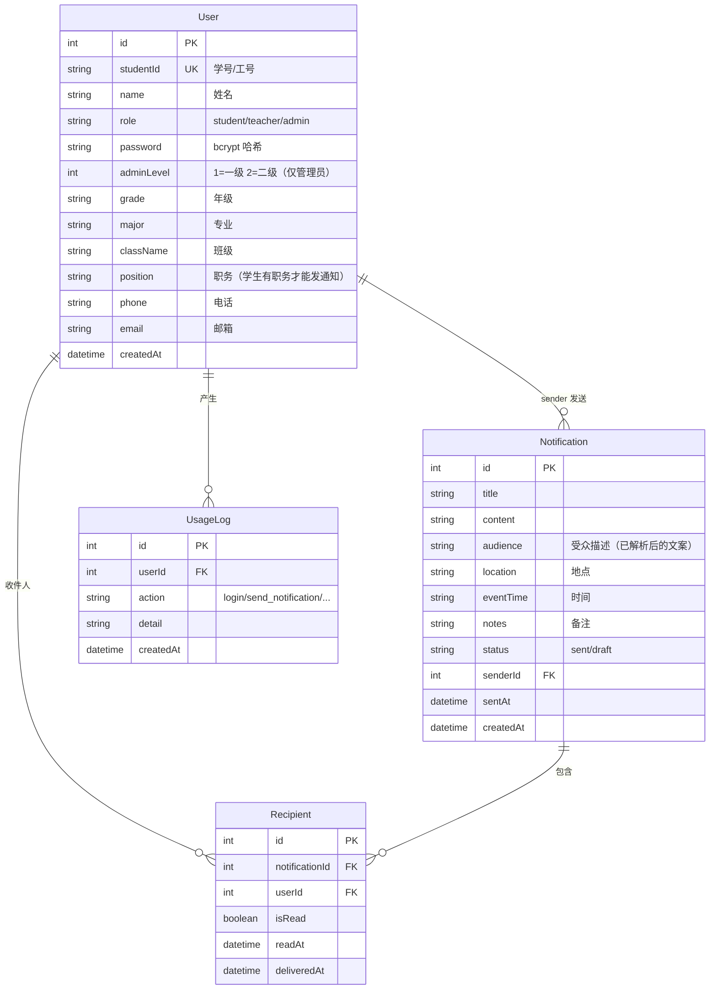

# 校园通知系统 · 技术说明

> 适用对象：开发 / 维护人员
> 本说明基于当前代码（含「账号 + 密码登录」与「管理员分级」功能）编写。

---

## 1. 项目概述

一个校园通知管理系统，包含两个前端页面和一个后端服务：

| 部分 | 文件 | 作用 |
|------|------|------|
| 用户端 | `index.html` | Vue 3 + Element Plus 对话式界面；普通用户（学生/教师）登录、用 AI 提取通知信息、发送/接收/查看通知 |
| 后台管理端 | `admin.html` | 管理员登录，总览统计、用户管理、使用记录、通知管理 |
| 后端 | `backend/`（Express + Prisma/SQLite） | 提供全部 REST API，端口 3001 |

核心特性：
- 账号（学号/工号）+ 密码登录，密码 bcrypt 哈希存储。
- 管理员账号在用户端登录后自动跳转后台管理端，且免二次登录。
- 管理员分级：一级管理员可看全部数据（含管理员信息和用户密码）；二级管理员看不到管理员信息和用户密码。

---

## 2. 技术栈

- **后端**：Node.js + Express 5 + Prisma 5（SQLite）
- **数据库**：SQLite（`backend/prisma/dev.db`）
- **密码**：bcryptjs（纯 JS 实现，无需编译）
- **AI 提取**：智谱 AI（GLM-4-Flash），`POST /api/ai/extract` 走后端代理，API Key 只在服务端 `.env`
- **前端（用户端）**：Vue 3 + Element Plus（CDN 引入，无构建步骤），类 ChatGPT 对话式界面，通过 `fetch` 直连 `http://localhost:3001/api`
- **前端（后台管理端）**：原生 HTML + CSS + JavaScript，通过 `fetch` 直连 `http://localhost:3001/api`

---

## 3. 目录结构

```
agent/
├─ index.html          # 用户端单页应用
├─ admin.html                # 后台管理端单页应用
├─ 账号.md                   # 可登录账号清单
├─ 技术说明.md               # 本文档
├─ 使用说明.md               # 使用文档
└─ backend/
   ├─ .env                   # 环境变量（DATABASE_URL / ZHIPU_API_KEY / PORT）
   ├─ package.json
   ├─ prisma/
   │  ├─ schema.prisma       # 数据模型
   │  ├─ seed.js             # 种子数据（默认密码 + 管理员账号）
   │  └─ migrations/         # 数据库迁移
   └─ src/
      ├─ server.js           # 服务入口，路由挂载
      ├─ prisma.js           # PrismaClient 单例
      ├─ auth.js             # 密码工具（哈希/校验/脱敏）
      ├─ audience.js         # 受众解析（"全体大二学生"→用户ID列表）
      ├─ aiExtract.js        # 智谱 AI 信息提取
      ├─ usage.js            # 使用记录埋点 logUsage()
      └─ routes/
         ├─ auth.js          # 用户端登录
         ├─ admin.js         # 后台管理员登录 + 鉴权中间件
         ├─ users.js         # 用户 CRUD（分级过滤）
         ├─ notifications.js # 通知收发（发送权限、草稿、已读）
         ├─ stats.js         # 总览统计
         ├─ usage.js         # 使用记录
         └─ ai.js            # AI 提取
```

---

## 4. 数据模型

### 4.1 实体关系



### 4.2 关键字段说明

- `User.role`：`student`（学生）、`teacher`（教师）、`admin`（管理员）。
- `User.adminLevel`：仅管理员使用。`1` = 一级管理员，`2` = 二级管理员。
- `User.password`：bcrypt 哈希（如 `$2b$10$...`），永不返回明文；普通接口通过 `sanitizeUser()` 脱敏移除该字段。
- `Recipient` 的 `@@unique([notificationId, userId])` 保证同一用户对同一通知只有一条收件记录。

### 4.3 数据库迁移

现有迁移（`backend/prisma/migrations/`）：

| 迁移 | 内容 |
|------|------|
| `20260823073126_init` | 初始表（User / Notification / Recipient） |
| `20260823132302_add_usage_log` | 新增 UsageLog（使用记录） |
| `20260823134055_add_user_position` | User 新增 position（职务） |
| `20260823143334_add_password_and_admin_level` | User 新增 password、adminLevel（本次） |

修改 schema 后需要：**先停止服务**，再执行 `npx prisma migrate dev`（运行中会因 DLL 占用报 EPERM）。

---

## 5. 认证与权限

### 5.1 用户端登录（普通用户 / 管理员）

- 接口：`POST /api/auth/login`
- 请求：`{ "studentId": "学号/工号", "password": "密码" }`
- 校验流程：查用户 → 校验密码（bcrypt）→ 写使用记录 `login`。
- 返回：
  - 普通用户：`{ user: <脱敏用户>, admin: false }`
  - 管理员：`{ user, admin: true, adminToken, adminLevel }`
- 前端 `index.html` 收到 `admin: true` 时，把 `adminToken/admin_level/admin_info` 写入 `sessionStorage` 后 `location.href = 'admin.html'`，实现**免二次登录**；用户端侧边栏另有「后台管理」入口直达 `admin.html`。

### 5.2 后台管理员登录

- 接口：`POST /api/admin/login`
- 请求：`{ "studentId": "管理员账号", "password": "密码" }`
- 校验：账号必须是 `role = 'admin'` 的用户，密码正确后签发内存 token。
- token 机制（`backend/src/routes/admin.js`）：
  - `sessions: Map<token, { userId, adminLevel }>`，存内存，**服务重启后全部失效**，需重新登录。
  - 鉴权中间件 `requireAdmin`：校验 `Authorization: Bearer <token>`，通过后把 `req.admin = { userId, adminLevel }`。
  - `requireLevel1`：仅一级管理员可用（预留）。
  - `createAdminSession(user)` / `getAdminSession(token)`：供用户端登录管理员时复用会话。

### 5.3 管理员分级权限矩阵

| 数据 | 一级管理员（adminLevel=1） | 二级管理员（adminLevel=2） |
|------|------|------|
| 用户列表 `GET /users` | 全部（含管理员账号 + 密码字段） | 仅学生/教师，无密码字段，不含管理员 |
| 用户详情 `GET /users/:id` | 全部字段 | 查看管理员详情返回 403 |
| 新增用户 `POST /users` | 可创建学生/教师/管理员 | 只能创建学生/教师，创建管理员 403 |
| 编辑用户 `PATCH /users/:id` | 可编辑任意用户（含管理员、设级别） | 编辑管理员 403；不能设为管理员 |
| 删除用户 `DELETE /users/:id` | 可删除任意用户 | 删除管理员 403 |
| 总览统计 `GET /stats` | userCount 含管理员，另有 adminCount | userCount 排除管理员 |
| 使用记录 `GET /usage` | 全部 | 过滤掉管理员账号的记录 |
| 通知列表 `GET /notifications` | 全部 | 过滤掉管理员发出的通知 |

> 密码字段仅在二级管理员不可见；接口层统一用 `sanitizeUser()` 对二级管理员脱敏，同时前端 `admin.html` 也按 `adminLevel` 隐藏密码列/管理员选项（前端隐藏为体验优化，权限最终以后端为准）。

### 5.4 发送通知权限（`notifications.js` 的 `assertCanSend`）

1. 学生无 `position`（职务）→ 403「学生需担任职务才能发送通知」。
2. 学生发送目标包含教师 → 403「学生不能向教师发送通知」。
3. 发送时自动排除发送者本人。
4. 教师不受限制。草稿创建/保存不校验，草稿转发送（`PATCH /:id/send`）时才校验。

---

## 6. API 接口清单

> 基础地址：`http://localhost:3001/api`
> 鉴权：管理员接口需请求头 `Authorization: Bearer <token>`（token 由 `/admin/login` 返回）
> 标注 `[管理]` 的接口需管理员 token；`[一级]` 表示仅一级管理员可执行相关操作。

### 6.1 健康检查

| 方法 | 路径 | 说明 |
|------|------|------|
| GET | `/api/health` | 服务存活检查，返回 `{ ok, time }` |

### 6.2 认证

| 方法 | 路径 | 权限 | 说明 |
|------|------|------|------|
| POST | `/api/auth/login` | 公开 | 用户端登录 `{ studentId, password }` |
| POST | `/api/admin/login` | 公开 | 后台登录 `{ studentId, password }`，返回 token |
| POST | `/api/admin/logout` | 公开 | 注销 token（header 或 body 携带） |

### 6.3 用户管理 `[管理]`

| 方法 | 路径 | 说明 |
|------|------|------|
| GET | `/api/users` | 用户列表；query：`keyword, role, grade, major, className` |
| GET | `/api/users/:id` | 用户详情 |
| POST | `/api/users` | 新增用户 `{ studentId, name, role?, adminLevel?, password?, ... }` `[一级]` 可建管理员 |
| PATCH | `/api/users/:id` | 编辑用户；传 `password` 会重新哈希；`[一级]` 可设管理员/级别 |
| DELETE | `/api/users/:id` | 删除用户（级联删通知/收件/使用记录）；`[一级]` 可删管理员 |

### 6.4 通知 `[管理]`（`GET /` 列表需管理员，其余为用户端接口）

| 方法 | 路径 | 权限 | 说明 |
|------|------|------|------|
| GET | `/api/notifications` | `[管理]` | 全部通知；query：`keyword, status` |
| POST | `/api/notifications` | 用户 | 发送/保存草稿 `{ senderId, title, content, audience, ... }` |
| GET | `/api/notifications/received?userId=` | 用户 | 我收到的通知（含已读状态） |
| GET | `/api/notifications/sent?userId=` | 用户 | 我发出的通知（含 readCount） |
| GET | `/api/notifications/:id` | 用户 | 通知详情（含收件人） |
| PATCH | `/api/notifications/:id/read` | 用户 | 标记已读 `{ userId }` |
| PATCH | `/api/notifications/:id` | `[管理]` | 编辑通知 |
| PATCH | `/api/notifications/:id/send` | 用户 | 草稿转发送 `{ userId }` |
| DELETE | `/api/notifications/:id/recipient` | 用户 | 收件人移除自己的记录 `{ userId }` |
| DELETE | `/api/notifications/:id` | 用户 | 删除整单通知 |

### 6.5 统计与使用记录 `[管理]`

| 方法 | 路径 | 说明 |
|------|------|------|
| GET | `/api/stats` | 总览统计（userCount/studentCount/teacherCount/adminCount/.../recent） |
| GET | `/api/usage` | 使用记录；query：`limit, userId, action` |
| DELETE | `/api/usage` | 清空所有使用记录 |

### 6.6 AI 提取

| 方法 | 路径 | 说明 |
|------|------|------|
| POST | `/api/ai/extract` | `{ text }` → `{ source: 'ai'\|'rule', result: { audience, time, location, notes } }`；API Key 由服务端 `.env` 读取 |

---

## 7. 前端说明

### 7.1 用户端 index.html

- **技术栈**：Vue 3（`vue.global.prod.js`）+ Element Plus（`index.full.min.js` + `index.css`）+ Element Plus 图标（`@element-plus/icons-vue`），全部 CDN 引入、无构建步骤；`ElementPlus.zhCn` 配置中文语言包；所有图标组件通过 `app.component()` 全局注册。
- **界面**：类 ChatGPT 对话气泡（用户气泡靠右且头像在右，AI 气泡靠左）；侧边栏含「新对话 / 通知中心 / 历史记录（置顶、删除、只看信息不全）/ 后台管理入口 / 当前用户」。
- **响应式 / 移动端**：≤768px 时隐藏桌面侧边栏，左上角 **「☰」三条杠** 按钮唤起侧边栏抽屉（`el-drawer`，82% 宽）；通知中心抽屉移动端全宽；登录/编辑弹窗按 `isMobile ? '92%' : '固定宽'` 自适应；输入区贴底并适配 iOS 安全区（`env(safe-area-inset-bottom)`）。
- **登录**：学号/工号 + 密码；管理员登录后 `location.href = 'admin.html'` 并携带会话（免二次登录）。
- **会话存储**：
  - `localStorage.campus_user`：当前登录用户（脱敏后）。
  - `localStorage.sessions_vue_v1`：AI 对话会话历史；消息对象含 `type`（`text/typing/result`），`result` 类型记录 `extraction / source / missing / status(pending|sent|draft|edited|failed) / rawText`。
- **AI 提取流程**：输入通知原文 → `POST /api/ai/extract` → 「提取结果卡片」内嵌 **存草稿 / 修改 / 确认发送** 按钮；「修改」用 el-dialog 编辑 受众/时间/地点/备注 后回填气泡再发；缺必填项时提示「信息不全」。
- **通知中心**：收件箱 / 已发送 / 草稿箱 三标签（`el-drawer` 抽屉），未读角标每 30s 轮询刷新。
- **后台互联**：侧边栏「后台管理」入口（`<a href="admin.html" target="_blank">`）直达后台管理端；后台顶栏「打开用户端」返回本页，两端互通。
- API 基址常量：`const API = 'http://localhost:3001/api'`。

### 7.2 后台管理端 `admin.html`

- **登录**：账号 + 密码（不再是单一密码）。
- **会话存储**（`sessionStorage`，关闭标签页即失效）：
  - `admin_token`：后台 token。
  - `admin_level`：1 或 2。
  - `admin_info`：当前管理员 JSON。
- **分级展示**：
  - 一级管理员：总览多一张「管理员」卡片；用户管理有「管理员」身份筛选、密码列、管理员级别字段。
  - 二级管理员：无「管理员」筛选、无密码列、新增/编辑弹窗无管理员级别字段。
- 请求 401（token 失效）时自动清空会话并回到登录页。

---

## 8. 密码与安全说明

- 密码使用 bcryptjs（`src/auth.js`）：`hashPassword()` / `verifyPassword()`。
- `sanitizeUser()` 在返回给前端的用户对象中移除 `password` 字段（二级管理员视角连字段都不出现）。
- 管理员 token 存内存 Map，无过期时间，**服务重启即失效**，安全性适合演示/内部环境。
- `.env` 中仍保留 `ADMIN_PASSWORD="admin123"`，但当前代码**已不再读取**该变量（后台改为数据库管理员账号校验），可忽略或删除。

---

## 9. 种子数据

`backend/prisma/seed.js` 运行后生成 18 个账号：

| 类型 | 账号 | 默认密码 |
|------|------|----------|
| 一级管理员 | `admin` | `admin123` |
| 二级管理员 | `admin2`、`admin3` | `admin123` |
| 教师 | `T001`~`T003` | `123456` |
| 学生 | `2023001`~`2026003`（共 12 个） | `123456` |

> 种子用 `upsert`（按 studentId），重复运行会**覆盖已有用户的密码/资料**。
